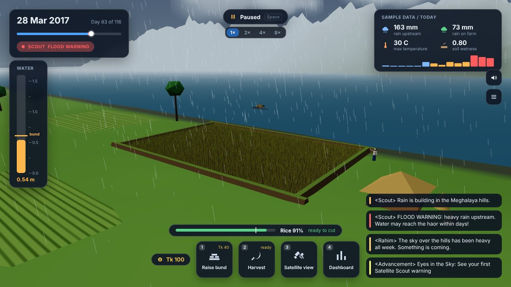
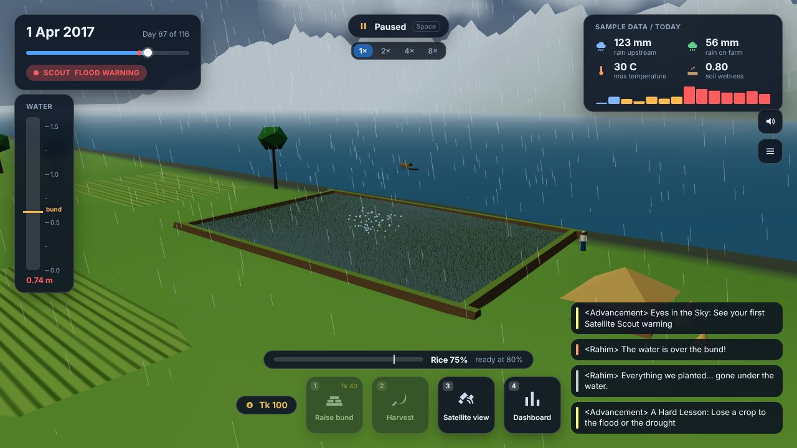
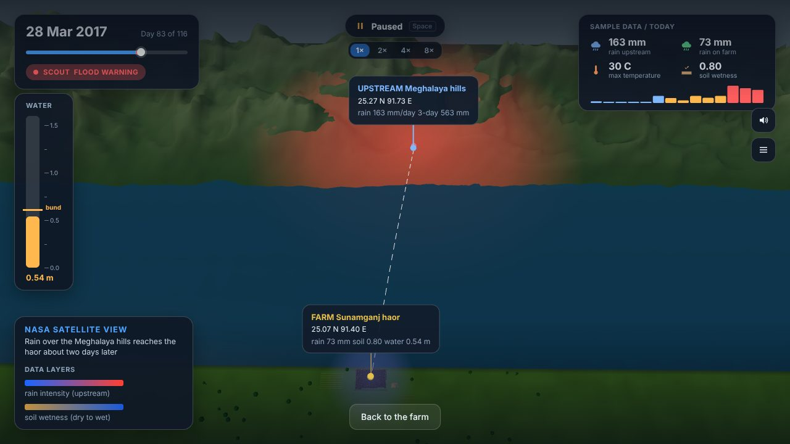
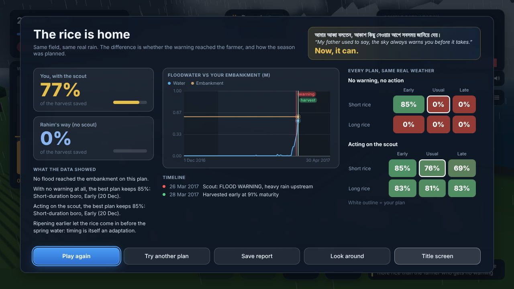
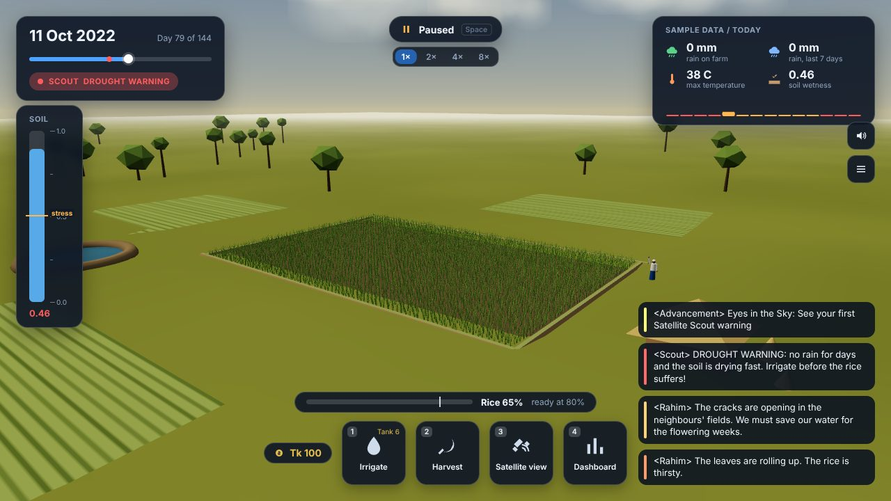
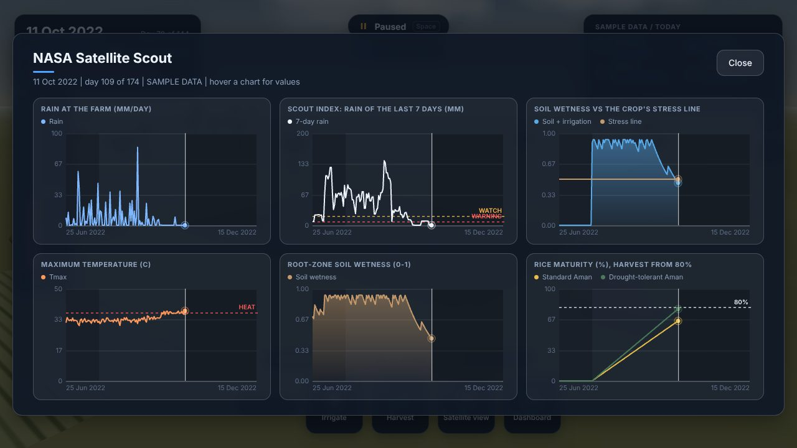
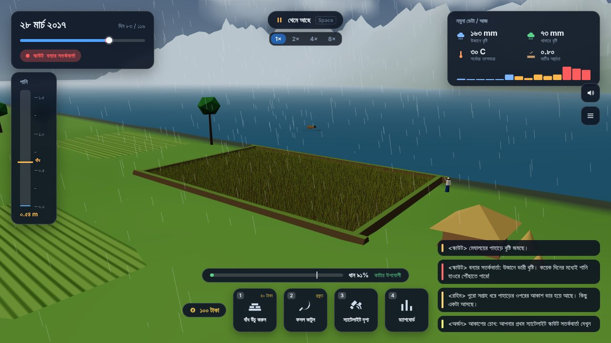

# Agrocene

[](https://github.com/Anthropocene-SpaceApps/Hold-The-Field/actions/workflows/test.yml)
[](https://github.com/Anthropocene-SpaceApps/Hold-The-Field/actions/workflows/game.yml)
[](https://github.com/Anthropocene-SpaceApps/Hold-The-Field/actions/workflows/release.yml)

**The climate raids your farm. NASA is your scout.**

A farming game where you replay a real flash flood or drought in Bangladesh, day by day, with NASA satellite data
warning you what is coming. Then it replays every other plan on the same weather, so the lesson is *what would have
worked*, not *you lost*.

NASA Space Apps Challenge 2026 · Chattogram, Bangladesh · **Team Anthropocene**
**Challenge:** [Field Shift: Adapting Farms with NASA Data](https://www.spaceappschallenge.org/2026/challenges/)

**▶ Play in your browser:** _add Vercel link_ · **Video:** _add YouTube link_ · **Desktop edition:** [Releases](https://github.com/Anthropocene-SpaceApps/Hold-The-Field/releases) · **Team page:** _add NASA team link_



---

## The sky always warns you

> *আমার বয়স তখন নয় কি দশ। বাবা বলত, আকাশের মতিগতি আসমান দেখেই বুঝি।*
> "I was nine, maybe ten. My father used to say you can read the sky's mood just by looking up." — Nodi, Hashem's daughter

Hashem farms boro rice in the Sunamganj haor. He planted the way his father did: same seed, same week, for forty years.
Then, weeks before harvest, a flash flood came in one night. NASA satellites had recorded the rain building in the
Meghalaya hills upstream. **The warning existed. It never reached him.**

You might think he lost his harvest in April. He lost it in December, when he chose a rice that needs 150 days instead
of a 125-day one, which would have been home before the water came. In Agrocene you go back to December with the
warning in your hands. **This time, someone is listening.**

*Hashem and Nodi are composite characters based on real haor farmers' experiences. The seasons and the data are real;
their story stands in for many.*

## How a season plays

1. **Plan.** Pick the scenario, the rice variety (short or long duration; drought-tolerant or standard) and the
   transplanting date. Ripening earlier is already an adaptation.
2. **Read the scout.** Every in-game day shows that day's NASA POWER readings: rain in the hills upstream, rain on the
   farm, temperature, root-zone soil wetness. The scout goes **Calm → Watch → Warning** from rules on that data, never
   from a scripted date.
3. **Act.** Raise the embankment or cut the rice from 80 % maturity (flood); irrigate from a limited village tank
   (drought). Every action costs money or yield.
4. **Debrief.** Your harvest against the farmer who got no warning, how many days ahead NASA's data spoke, and a grid of
   every variety and planting date, with and without the warning, on the same real weather. Save it as a report (text +
   CSV) for a class or an extension officer.

Switch to **Hashem's way** on the plan screen to watch the same season with no warning and no action.

## Two scenarios

| | Sunamganj haor, boro 2017 | Barind Tract, Aman 2022 |
|---|---|---|
| Hazard | Flash flood from rain in the Meghalaya hills | A dry spell while the rice is flowering |
| The scout reads | 3-day upstream rain (it reaches the haor about two days later) | 7-day farm rain and root-zone soil wetness |
| You can | Raise the embankment, harvest early | Irrigate from the village tank, harvest early |
| Varieties | Short (90 days, 85 % yield) or long (115 days, 100 %) | Drought-tolerant (100 days, 88 %) or standard (120 days, 100 %) |

The Satkhira coast (salinity) is on the plan screen as the next scenario.

| | |
|---|---|
|  |  |
| **Hashem's way.** No warning reached him: the water is over the bund. | **NASA satellite view.** The upstream rain layer over the hills, the farm, and the path the water takes. |
|  |  |
| **Debrief.** Lead time, your result against the farmer with no warning, and every plan on the same weather. | **Barind drought.** Soil below the stress line, the scout's drought warning, the tank for irrigation. |
|  |  |
| **Scout dashboard.** Everything NASA has measured so far; the future stays hidden. | **বাংলা.** One tap on the title screen switches the whole game, with Bengali digits and dates. |

## NASA data

| Dataset | Parameters | Drives |
|---|---|---|
| [NASA POWER](https://power.larc.nasa.gov) Daily API, community AG | `PRECTOTCORR` precipitation, `T2M_MAX` maximum temperature, `GWETROOT` root-zone soil wetness | The water level, the soil, every scout warning, the dashboard and the satellite view |

Points: haor farm 25.07° N 91.40° E and its upstream catchment 25.27° N 91.73° E (Cherrapunji / Sohra, Meghalaya);
Barind farm 24.60° N 88.50° E. NASA POWER is global, so the same engine works for any farm on Earth by changing a
latitude and longitude. How the data becomes gameplay, and every simplification: [`docs/DATA.md`](docs/DATA.md).

**Getting the real seasons into the repo.** The data files are generated, never typed in:

- **One click:** GitHub → **Actions → nasa-data → Run workflow**. It fetches both seasons from NASA POWER, prints a
  calibration report, and opens a pull request with `data/haor-2017.json` and `data/barind-2022.json`.
- **Or locally:** `python3 data-pipeline/fetch_power.py --region haor --start 20161201 --end 20170430 --out data/haor-2017.json`
  (and `--region barind --start 20220625 --end 20221215 --out data/barind-2022.json`).
- **Or in the game:** web → *Data & Model* → *Fetch from NASA POWER now*; desktop → launcher → *NASA Data*.

Until real files are committed the game uses clearly labelled **SAMPLE** files and says so on every screen. After
fetching, run `node scripts/calibrate.mjs data/haor-2017.json --target <documented flood date>` and copy the fitted
numbers into `src/sim/config.js` and `game/.../sim/Config.java`, so the real 2017 rain floods the field near the real date.

## Who it helps

- **Students in farming regions**, learning how climate is changing the land their families farm.
- **Farming families**, seeing why short-duration or tolerant varieties, planting dates, irrigation timing and early
  warnings matter.
- **Agricultural extension officers**, who need to *show*, not just tell. The debrief exports as text and CSV.

Bangla-first, free, no login, and the web build runs on a mid-range phone.

## Play it

**In a browser** (no install): open the live link. Drag to look around, scroll or pinch to zoom.

| Key | Action |
|---|---|
| Space | Start / pause the season (`+` / `-` change the speed, up to 8 days a second) |
| 1 | Raise the embankment (flood) or irrigate (drought) |
| 2 | Harvest (from 80 % maturity) |
| 3 or M | NASA satellite view |
| 4 or E | Scout dashboard |
| Click Hashem | Hear what he thinks about the sky right now |
| Esc | Menu |

On a phone, the same actions are the buttons at the bottom.

**Desktop edition** (realistic 3D, walk the farm in first person, launcher, saves): get the build for your system from
the [Releases page](https://github.com/Anthropocene-SpaceApps/Hold-The-Field/releases). No Java needed.

| System | File | How to start it |
|---|---|---|
| Windows | `.msi` installer, or the portable `.zip` | Install, or unzip and run `Agrocene.exe`. SmartScreen: More info → Run anyway |
| macOS | `.dmg` (Apple silicon or Intel) | Drag to Applications. First start: right-click → Open |
| Linux | `.AppImage` (or `.deb`, or portable `.tar.gz`) | `chmod +x Agrocene-*.AppImage && ./Agrocene-*.AppImage` |
| Anything with Java 21 | `Agrocene-<version>.jar` | `java -jar Agrocene-<version>.jar` |

It needs a GPU driver with OpenGL 3.3. The builds are not code-signed, hence the warnings; see [`docs/RELEASING.md`](docs/RELEASING.md).

## Under the hood

One simulation, two front ends, the same answers:

```
data/*.json                 NASA POWER seasons (generated by data-pipeline/ or the nasa-data workflow)
src/sim/                    the engine for the web build: pure functions, no DOM, no randomness
game/.../sim/               the same engine in Java for the desktop build
src/world/                  web 3D farm (Three.js, vendored in vendor/three, everything generated in code)
src/ui/, src/main.js        web HUD, plan, dashboard, debrief, satellite view
game/                       desktop game (Java 21, LWJGL/OpenGL), launcher, packaging
```

- **Deterministic and tested.** Same data + same actions = same season. `node --test` and `mvn test` run the same
  cases on both engines (flood, drought, warnings before the hazard, the planning grid, determinism), and both builds
  give identical debriefs.
- **Light.** The web build is static files with no build step and no runtime dependencies from a CDN: about 1 MB in
  total including Three.js. One instanced mesh draws every rice plant; the resolution drops automatically on slow devices.
- **Offline-ready.** The game never calls an API while you play; the data ships with it.

## Run from source

```bash
git clone https://github.com/Anthropocene-SpaceApps/Hold-The-Field.git
cd Hold-The-Field
python3 -m http.server 5173      # web build: open http://localhost:5173
node --test                      # web engine tests

cd game && mvn package           # desktop build (Java 21 + Maven)
java -jar target/agrocene.jar    # opens the launcher; press PLAY
```

Deploying the web build: import the repo on Vercel with the **Other** preset, no build command, output directory `.`
(or any static host). Controls, graphics options and the desktop code layout: [`game/README.md`](game/README.md).
Game design and what players learn: [`docs/GAME_DESIGN.md`](docs/GAME_DESIGN.md).

## Next (November hackathon)

- The Satkhira coast: salt surges, with salt-tolerant rice and floating gardens as defences.
- More NASA data: GPM IMERG rainfall, SMAP soil moisture and MODIS crop health, plus a partner agency dataset.
- Same field, 1981 to 2050: the raids get harder as the climate shifts.
- Playtests with farmers and extension officers in the haor.

## Team Anthropocene

| Name | Role |
|---|---|
| Alif | Mission Lead: direction, repo, data pipeline, deployment |
| Safwat | Systems Engineer: architecture, game loop, CI, performance |
| Yasin | Systems Designer: game mechanics, renderer, interactions |
| Zawad | Creative Director: visual identity, art, UI |
| Yaminur | Science & Research Lead: climate and crop facts, sources |
| Marwa | Narrative Lead: story, script, presentation |

## Use of AI

See [`docs/AI_USAGE.md`](docs/AI_USAGE.md): every AI tool we used, what it did, and what it worked on. No AI-generated
content is presented as real data. All models, textures and sounds in both builds are generated by code.

## License

MIT. Everything built during Space Apps stays open source. Three.js is MIT (`vendor/three/LICENSE`). Fonts: Inter and
Noto Sans Bengali (SIL OFL) on the web; DejaVu Sans and Noto Sans Bengali in the desktop build
(`game/src/main/resources/fonts/`).
