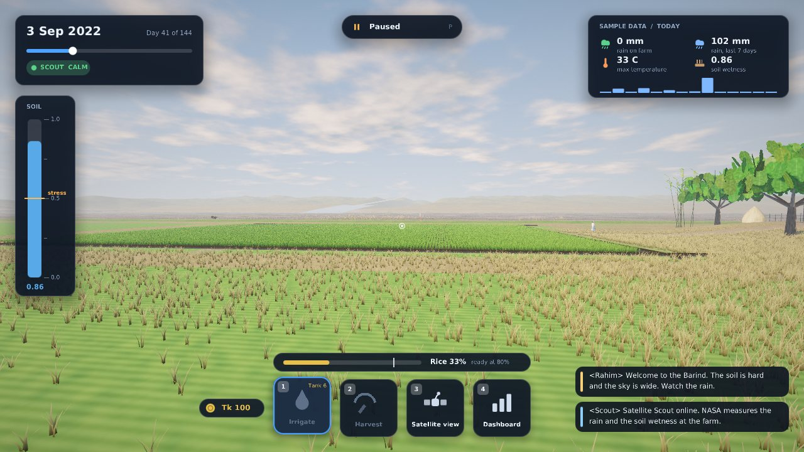
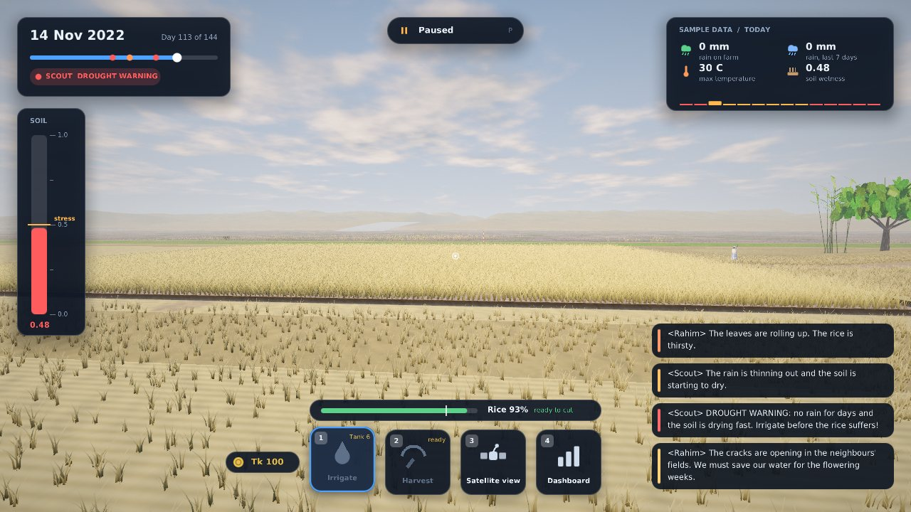
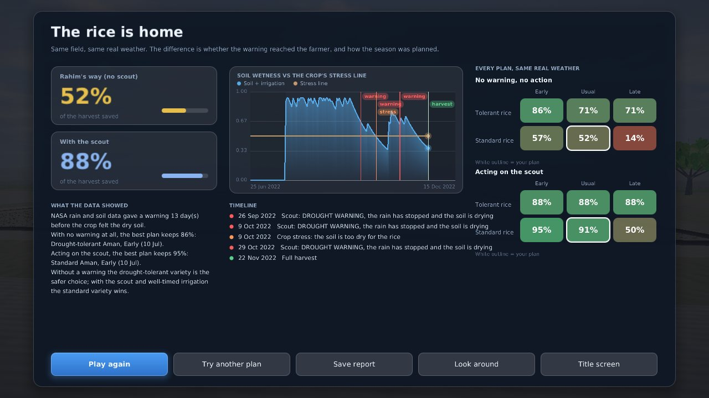
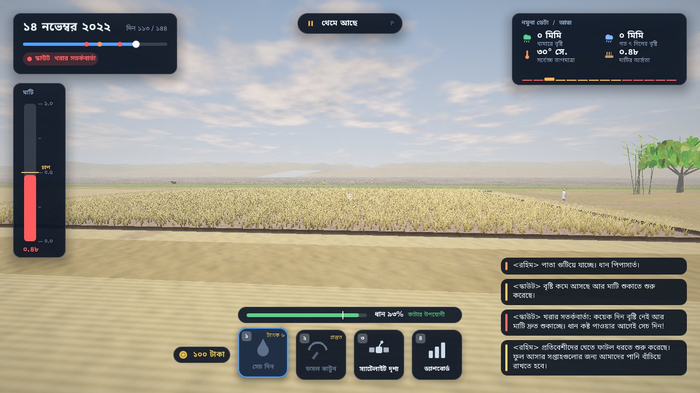
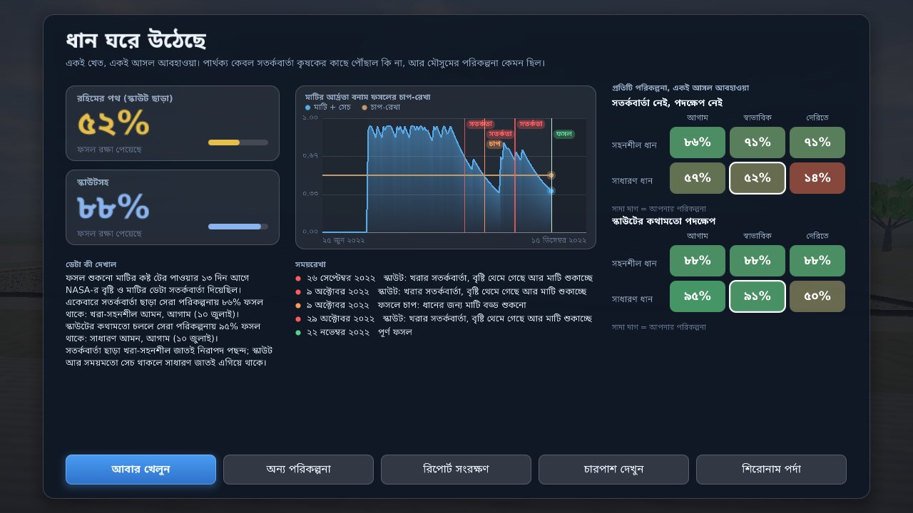

# Hold the Field

[](https://github.com/Anthropocene-SpaceApps/Hold-The-Field/actions/workflows/game.yml)
[](https://github.com/Anthropocene-SpaceApps/Hold-The-Field/actions/workflows/release.yml)

**A farming game where the climate raids your fields and NASA satellite data is your scout.**
Two real hazards, two regions of Bangladesh, English and Bengali.

NASA Space Apps Challenge 2026 · Chattogram, Bangladesh · **Team Anthropocene**
**Challenge:** [Field Shift: Adapting Farms with NASA Data](https://www.spaceappschallenge.org/2026/challenges/)
**Video:** _add YouTube link_ · **Team page:** _add NASA team link_


---

## Download and play

Get the build for your system from the **[Releases page](https://github.com/Anthropocene-SpaceApps/Hold-The-Field/releases)**. No Java needed.

| System | File | How to start it |
|---|---|---|
| Windows | `.msi` installer, or the portable `.zip` | Install, or unzip and run `Hold the Field.exe`. SmartScreen: More info → Run anyway |
| macOS | `.dmg` (Apple silicon or Intel) | Drag to Applications. First start: right-click → Open |
| Linux | `.AppImage` (or `.deb`, or portable `.tar.gz`) | `chmod +x HoldTheField-*.AppImage && ./HoldTheField-*.AppImage` |
| Anything with Java 21 | `HoldTheField-<version>.jar` | `java -jar HoldTheField-<version>.jar` |

You need a GPU driver with **OpenGL 3.3** (anything from the last ten years). The builds are not code-signed, hence the
warnings; see [`docs/RELEASING.md`](docs/RELEASING.md). Press **PLAY** in the launcher.

## The idea

Rahim farms rice in Bangladesh. His father taught him the sky always warns before it takes. In 2017 a flash flood took
his harvest days before it was ready, with no warning he could see. NASA satellites *did* see the rain building in the
hills upstream.

In this game you replay a real season, day by day. You plan it first (which rice, which transplanting date), then farm
it with the **Satellite Scout** watching the data. Afterwards the game replays every alternative on the same weather, so
the lesson is *what would have worked*, not *you lost*.

Full design, what players learn and what is still missing: [`docs/GAME_DESIGN.md`](docs/GAME_DESIGN.md).

## Two scenarios

| | Sunamganj haor, boro 2017 | Barind Tract, Aman 2022 |
|---|---|---|
| Hazard | Flash flood from rain in the Meghalaya hills | A dry spell while the rice is flowering |
| The scout reads | Upstream rain (arrives two days later) | Farm rain and root-zone soil wetness |
| You can | Raise the embankment, harvest early | Irrigate from a limited village tank, harvest early |
| Varieties | Short (90 days) or long (115 days) | Drought-tolerant or standard |

| | |
|---|---|
|  |  |
| **Plan the season.** Pick the scenario, the variety and the transplanting date. | **The scout speaks.** Rain upstream becomes a warning two days before the water arrives. |
|  |  |
| **The flood.** Water over the embankment, drowned rice, rain on muddy water. | **NASA satellite view.** Rain and soil wetness layers at the real coordinates. |
|  |  |
| **Barind, early season.** Wet fields, soil gauge full. | **The dry spell.** Baked mud, wilting rice, soil below the stress line, red scout alert. |
|  |  |
| **Debrief.** Warning lead time, your result against the no-warning farmer, and every plan on the same weather. | **Scout dashboard.** Interactive charts of everything NASA measured so far. |

### In Bengali

Options → **Language** (or the launcher's Settings tab) switches the whole game to বাংলা: proper conjuncts and vowel
signs, Bengali digits and month names.

| | |
|---|---|
|  |  |

The translation was written by an AI assistant and **needs a native speaker's review** before it is presented as final
(`game/src/main/resources/lang/bn.txt`).

## Who it helps

- **Students** in farming regions, learning how climate is changing their land
- **Farming families**, seeing why short-duration or tolerant varieties, planting dates, irrigation timing and early warnings matter
- **Agricultural extension officers**, who need to *show*, not just tell. The debrief exports as a text report and a CSV.

NASA POWER is global, so the same engine works for any farm on Earth by changing a latitude and longitude.

## NASA data used

| Dataset | Parameters | Used for |
|---|---|---|
| NASA POWER Daily API (community AG) | `PRECTOTCORR` precipitation, `T2M_MAX` max temperature, `GWETROOT` root-zone soil wetness | Daily weather that drives the water level, the soil, the scout warnings, the dashboard and the satellite view |

Points: haor farm 25.07°N 91.40°E and its upstream catchment 25.27°N 91.73°E (Cherrapunji/Sohra, Meghalaya); Barind farm 24.60°N 88.50°E.
How the data becomes gameplay, and every simplification: [`docs/DATA.md`](docs/DATA.md).

> **The repository ships SAMPLE data**, clearly labelled in the game, so it always starts. The Barind sample is an
> invented dry spell, not the weather of 2022. Replace both with the real seasons: launcher → **NASA Data** →
> **Update NASA data** (needs internet once, then works offline).

## Build and run from source

You need **Java 21** and Maven.

```bash
git clone https://github.com/Anthropocene-SpaceApps/Hold-The-Field.git
cd Hold-The-Field/game
mvn package
java -jar target/hold-the-field.jar     # opens the launcher; press PLAY
```

Controls, graphics options and the code layout: [`game/README.md`](game/README.md).
Native installers and the AppImage: [`docs/RELEASING.md`](docs/RELEASING.md).
CI (`.github/workflows/game.yml`) builds the jar and runs the tests on every push; `release.yml` builds the downloads when a `v*` tag is pushed.

**The web prototype** (the original browser version, kept as a no-install demo) is the top-level `index.html`, `src/`, `styles/` and `data/`:

```bash
python3 -m http.server 5173     # then open http://localhost:5173
node --test                     # run the prototype's simulation tests
```

Fetch real data from the command line instead of the launcher:

```bash
python3 data-pipeline/fetch_power.py --region haor   --start 20161201 --end 20170430 --out data/haor-2017.json
python3 data-pipeline/fetch_power.py --region barind --start 20220625 --end 20221215 --out data/barind-2022.json
```

## Team Anthropocene

| Name | Role |
|---|---|
| Alif | Mission Lead: direction, repo, data pipeline, deployment |
| Safwat | Systems Engineer: architecture, game loop, CI, performance |
| Yasin | Systems Designer: game mechanics, renderer, interactions |
| Zawad | Creative Director: visual identity, art, UI |
| Yaminur | Science & Research Lead: climate and crop facts, sources |
| Marwa | Narrative Lead: story, script, presentation |

## Use of AI

See [`docs/AI_USAGE.md`](docs/AI_USAGE.md). Every AI tool we used is listed there with its purpose. All textures, models and sounds in the game are generated by code.

## License

MIT. Everything built during Space Apps stays open source. Fonts: DejaVu Sans (free licence) and Noto Sans Bengali (SIL OFL), see `game/src/main/resources/fonts/`.
