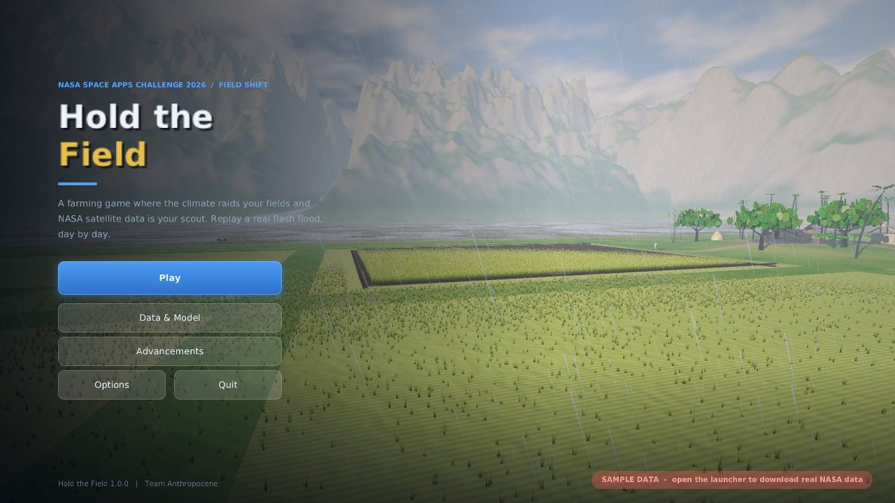
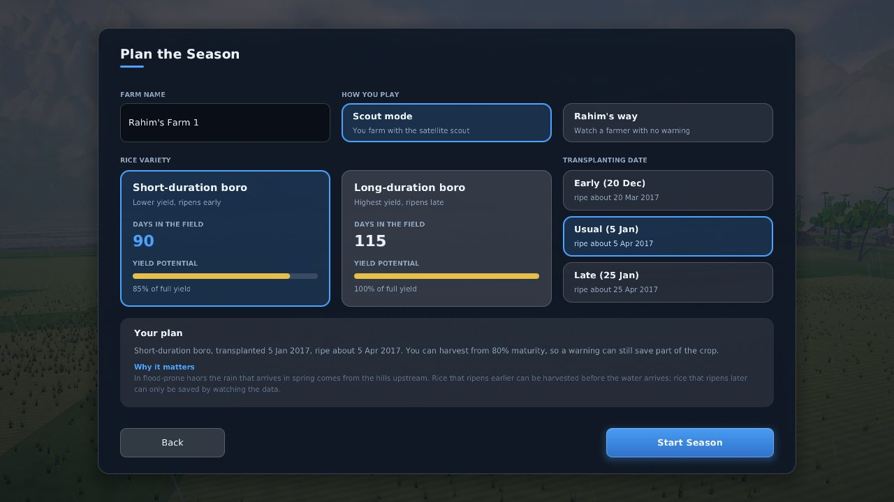
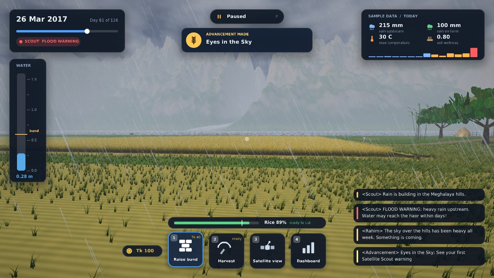
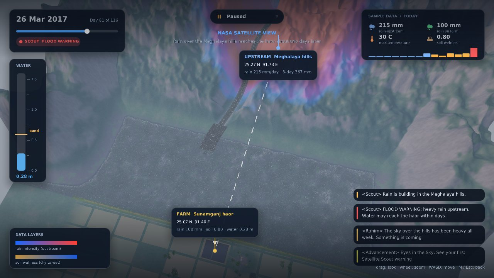
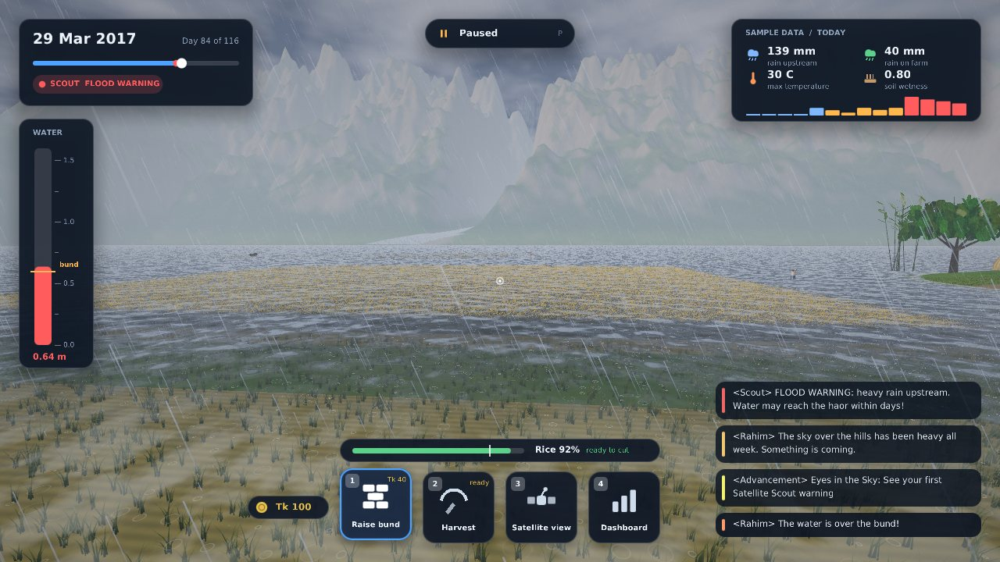
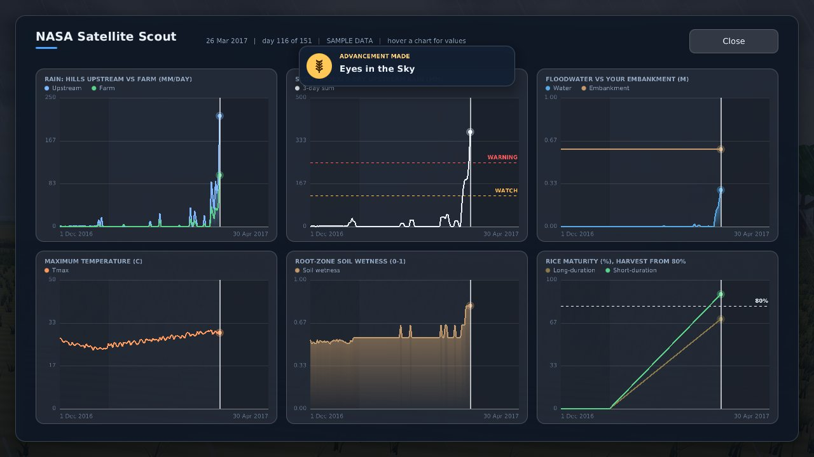
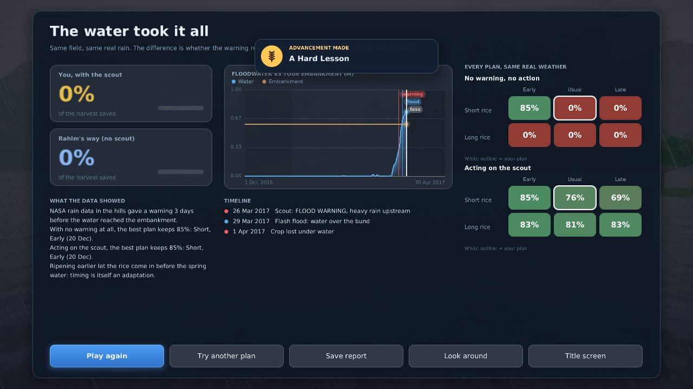

# Hold the Field

[](https://github.com/Anthropocene-SpaceApps/Hold-The-Field/actions/workflows/game.yml)

**A farming game where the climate raids your fields and NASA satellite data is your scout.**

NASA Space Apps Challenge 2026 · Chattogram, Bangladesh · **Team Anthropocene**
**Challenge:** [Field Shift: Adapting Farms with NASA Data](https://www.spaceappschallenge.org/2026/challenges/)
**Video:** _add YouTube link_ · **Team page:** _add NASA team link_



---

## The idea

Rahim farms rice in the Sunamganj haor. His father taught him the sky always warns before it takes. In 2017, a flash flood took his harvest days before it was ready, with no warning he could see.

NASA satellites *did* see the rain building in the hills upstream. In this game you replay that real season, day by day. You plan it first (which rice, which transplanting date), then farm it with the **Satellite Scout** watching the data. Raise the embankment, harvest early, or watch the water decide. Afterwards the game replays every alternative on the same weather, so the lesson is *what would have worked*, not *you lost*.

Full design, what players learn and what is still missing: [`docs/GAME_DESIGN.md`](docs/GAME_DESIGN.md).

| | |
|---|---|
|  |  |
| **Plan the season.** Short rice ripens sooner but yields less; the planting date moves the whole schedule. | **The scout speaks.** Rain upstream becomes a warning two days before the water arrives. |
|  |  |
| **NASA satellite view.** Rain intensity and soil wetness, the farm and the upstream hills at their real coordinates. | **The flood.** Water over the embankment, drowned rice, rain on muddy water. |
|  |  |
| **Scout dashboard.** Interactive charts of everything NASA measured so far. | **Debrief.** Your result against the farmer who got no warning, and every plan on the same real weather. |

## Who it helps

- **Students** in farming regions, learning how climate is changing their land
- **Farming families**, seeing why short-duration varieties, planting dates and early warnings matter
- **Agricultural extension officers**, who need to *show*, not just tell. The debrief exports as a text report and a CSV.

NASA POWER is global, so the same engine works for any farm on Earth by changing a latitude and longitude.

## NASA data used

| Dataset | Parameters | Used for |
|---|---|---|
| NASA POWER Daily API (community AG) | `PRECTOTCORR` precipitation, `T2M_MAX` max temperature, `GWETROOT` root-zone soil wetness | Daily weather that drives the water level, scout warnings, the dashboard and the satellite view |

Points: farm 25.07°N 91.40°E (Sunamganj haor); upstream 25.27°N 91.73°E (Cherrapunji/Sohra, Meghalaya).
How the data becomes gameplay, and every simplification: [`docs/DATA.md`](docs/DATA.md).

> **The repository ships SAMPLE data**, clearly labelled in the game, so it always starts. Replace it with the real season: launcher → **NASA Data** → **Update NASA data** (needs internet once, then works offline).

## Play it

You need **Java 21** and a GPU with **OpenGL 3.3**. One jar runs on Windows, macOS and Linux.

```bash
git clone https://github.com/Anthropocene-SpaceApps/Hold-The-Field.git
cd Hold-The-Field/game
mvn package
java -jar target/hold-the-field.jar     # opens the launcher; press PLAY
```

Controls, graphics options and the code layout: [`game/README.md`](game/README.md).
CI (`.github/workflows/game.yml`) builds the jar and runs the tests on every push.

**The web prototype** (the original browser version, kept as a no-install demo) is the top-level `index.html`, `src/`, `styles/` and `data/`:

```bash
python3 -m http.server 5173     # then open http://localhost:5173
node --test                     # run the prototype's simulation tests
```

Fetch real data from the command line instead of the launcher:

```bash
python3 data-pipeline/fetch_power.py --region haor --start 20161201 --end 20170430 --out data/haor-2017.json
```

## Team Anthropocene

| Name | Role |
|---|---|
| Alif | Mission Lead: direction, repo, data pipeline, deployment |
| Safwat | Systems Engineer: architecture, game loop, CI, performance |
| Yasin | Systems Designer: game mechanics, renderer, interactions |
| Zawad | Creative Director: visual identity, art, UI |
| Yaminur | Science & Research Lead: climate and crop facts, sources |
| Marwa | Narrative Lead: story, script, presentation |

## Use of AI

See [`docs/AI_USAGE.md`](docs/AI_USAGE.md). Every AI tool we used is listed there with its purpose. All textures, models and sounds in the game are generated by code.

## License

MIT. Everything built during Space Apps stays open source.
